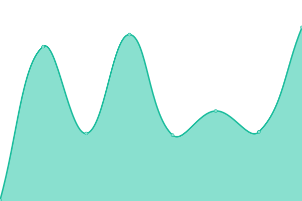
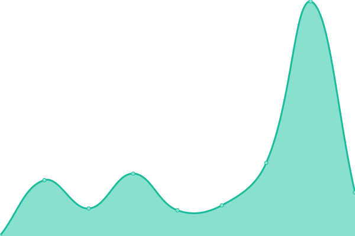
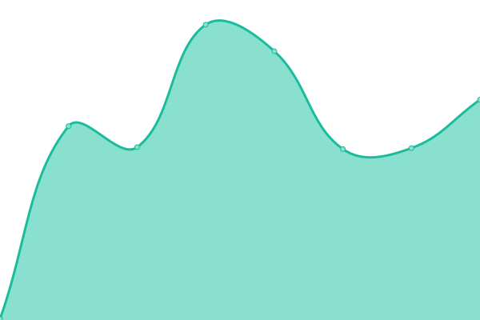

# [📈 Live Status](https://uptime.traviskuennen.com): <!--live status--> **🟩 All systems operational**

This repository contains the open-source uptime monitor and status page for [Travis Kuennen](https://www.traviskuennen.com), powered by [Upptime](https://github.com/upptime/upptime).

With [Upptime](https://upptime.js.org), you can get your own unlimited and free uptime monitor and status page, powered entirely by a GitHub repository. We use [Issues](https://github.com/tkuennen/upptime/issues) as incident reports, [Actions](https://github.com/tkuennen/upptime/actions) as uptime monitors, and [Pages](https://uptime.traviskuennen.com) for the status page.

<!--start: status pages-->
<!-- This summary is generated by Upptime (https://github.com/upptime/upptime) -->
<!-- Do not edit this manually, your changes will be overwritten -->
<!-- prettier-ignore -->
| URL | Status | History | Response Time | Uptime |
| --- | ------ | ------- | ------------- | ------ |
|  [www.traviskuennen.com (Landing)](https://www.traviskuennen.com) | 🟩 Up | [www-traviskuennen-com-landing.yml](https://github.com/tkuennen/uptime/commits/HEAD/history/www-traviskuennen-com-landing.yml) | 

 306ms
     
 | 

<a href="https://uptime.traviskuennen.com/history/www-traviskuennen-com-landing">100.00%</a>
    

|  [til.traviskuennen.com (Today I learned)](https://til.traviskuennen.com) | 🟩 Up | [til-traviskuennen-com-today-i-learned.yml](https://github.com/tkuennen/uptime/commits/HEAD/history/til-traviskuennen-com-today-i-learned.yml) | 

 289ms
     
 | 

<a href="https://uptime.traviskuennen.com/history/til-traviskuennen-com-today-i-learned">100.00%</a>
    

|  [jokes.traviskuennen.com](https://jokes.traviskuennen.com) | 🟩 Up | [jokes-traviskuennen-com.yml](https://github.com/tkuennen/uptime/commits/HEAD/history/jokes-traviskuennen-com.yml) | 

 352ms
     
 | 

<a href="https://uptime.traviskuennen.com/history/jokes-traviskuennen-com">100.00%</a>
    

|  [Google](https://www.google.com) | 🟩 Up | [google.yml](https://github.com/tkuennen/uptime/commits/HEAD/history/google.yml) | 

 443ms
     
 | 

<a href="https://uptime.traviskuennen.com/history/google">100.00%</a>
    

|  [Wikipedia](https://en.wikipedia.org) | 🟩 Up | [wikipedia.yml](https://github.com/tkuennen/uptime/commits/HEAD/history/wikipedia.yml) | 

 614ms
     
 | 

<a href="https://uptime.traviskuennen.com/history/wikipedia">100.00%</a>
    

|  [Hacker News](https://news.ycombinator.com) | 🟩 Up | [hacker-news.yml](https://github.com/tkuennen/uptime/commits/HEAD/history/hacker-news.yml) | 

 428ms
     
 | 

<a href="https://uptime.traviskuennen.com/history/hacker-news">100.00%</a>
    

|  [HOME](https://home.in.kuennen.net) | 🟩 Up | [home.yml](https://github.com/tkuennen/uptime/commits/HEAD/history/home.yml) | 

 22ms
     
 | 

<a href="https://uptime.traviskuennen.com/history/home">100.00%</a>
    

|  [Cloud](https://cloud.in.kuennen.net) | 🟩 Up | [cloud.yml](https://github.com/tkuennen/uptime/commits/HEAD/history/cloud.yml) | 

 193ms
     
 | 

<a href="https://uptime.traviskuennen.com/history/cloud">100.00%</a>
    

<!--end: status pages-->

[**Visit my status website →**](https://uptime.traviskuennen.com)

## 📄 License

- Powered by: [Upptime](https://github.com/upptime/upptime)
- Code: [MIT](./LICENSE) © [Travis Kuennen](https://www.traviskuennen.com)
- Data in the `./history` directory: [Open Database License](https://opendatacommons.org/licenses/odbl/1-0/)
